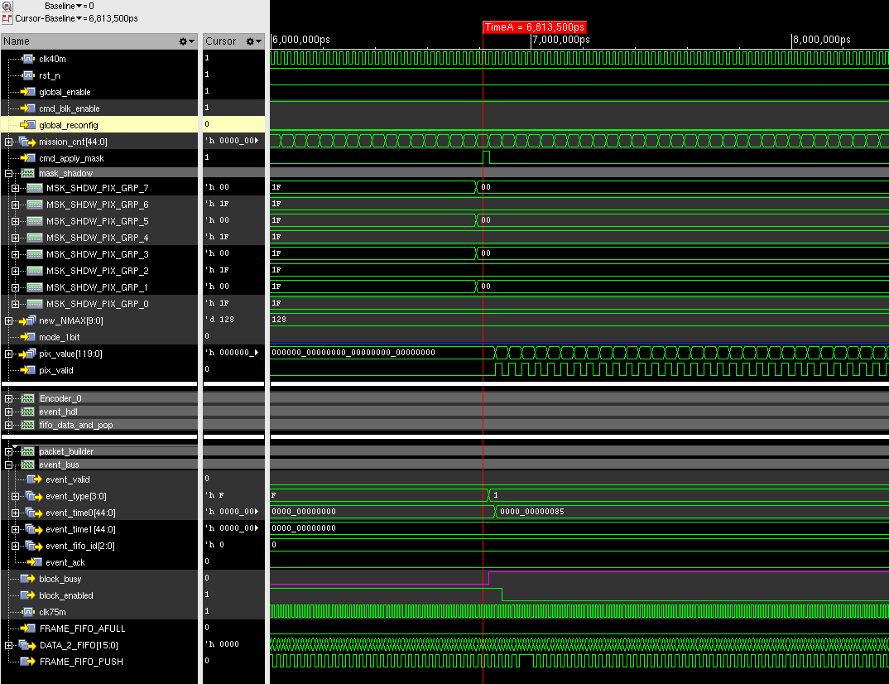
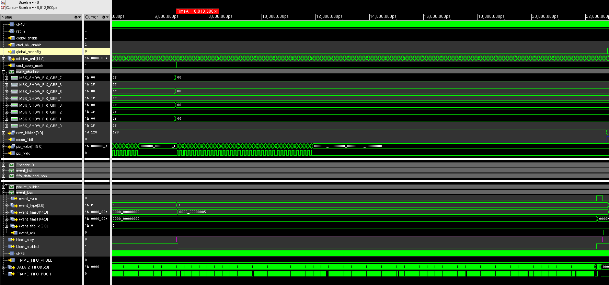
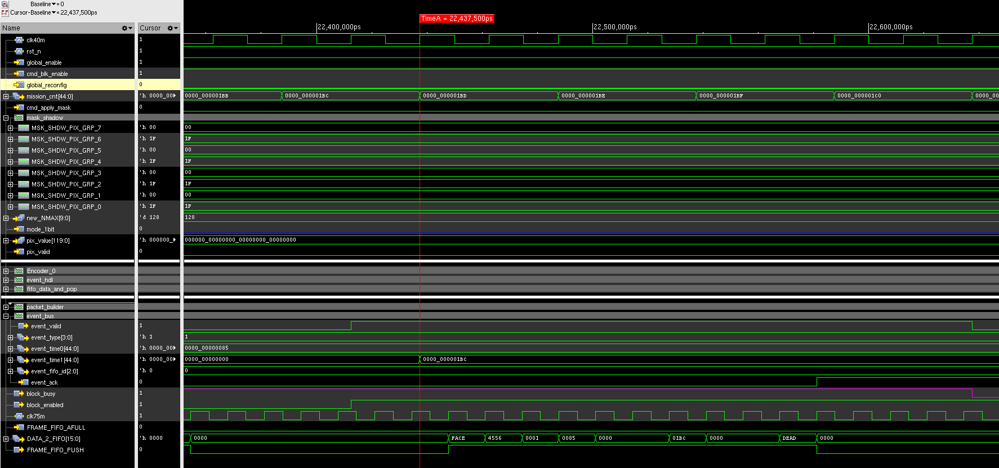
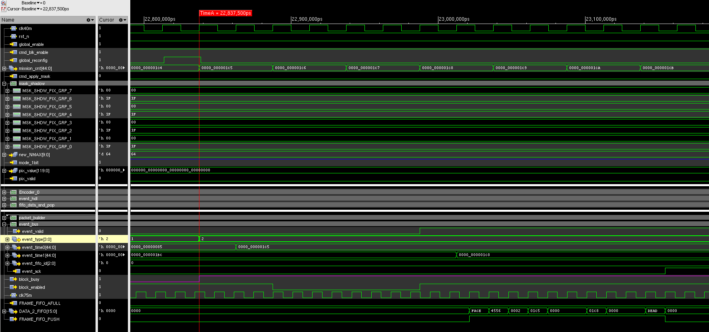
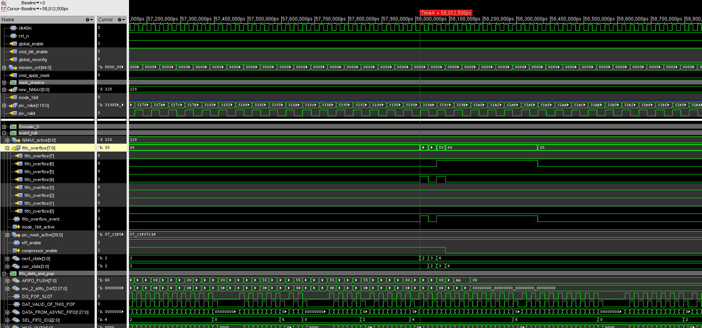
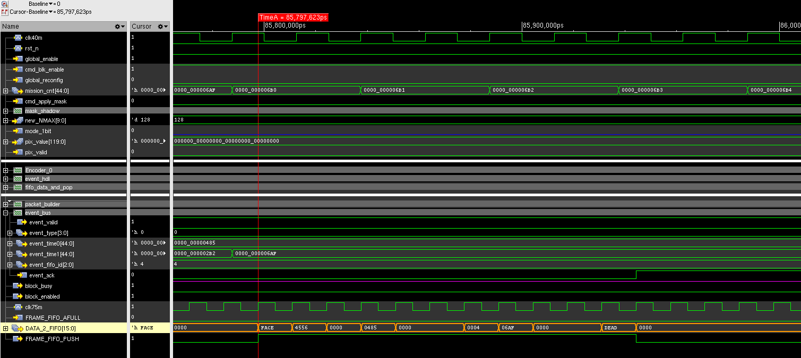
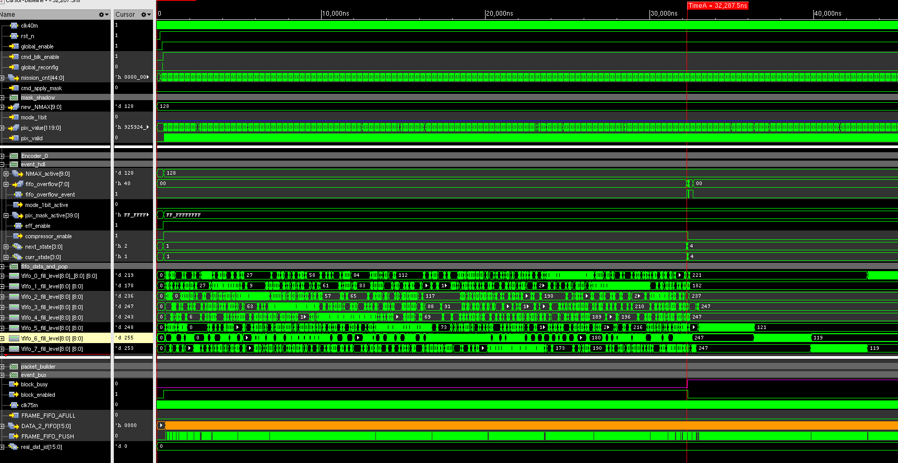
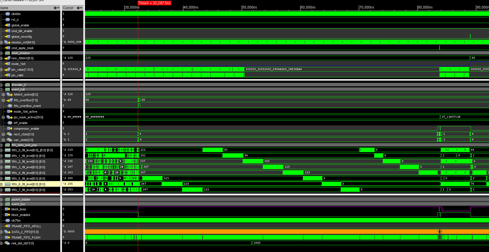
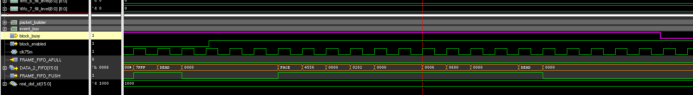

# Chip5 Messiah

To start the next chip development, we will call it project Messiah.

---


## 13 Aug 2026

Since I have come up with the new compression algorithm, I will proceed the hardware implementation now, maybe also with the implementation of one-bit mode included.

But we need to consider the impact our threshold will have to our images, and when we convert the pixel values into binary, we need to know where 0.5 is.

And to add it on top, the pixel values are sent over in gray code.

| Rescombo| 000 |   |001|     | 010 |     | 011 |     | 100 |     | 101 |     | 110 |     | 111 |
|-----|-----|-----|-----|-----|-----|-----|-----|-----|-----|-----|-----|-----|-----|-----|-----|
| Gray| 000 |     | 001 |     | 011 |     | 010 |     | 110 |     | 111 |     | 101 |     | 100 |
| 001 |     | 0.13|     | 0.19|     | 0.25|     | 0.31|     | 0.38|     |0.44 |     | 0.50|     |
| 010 |     | 0.14|     | 0.21|     | 0.29|     | 0.36|     | 0.43|     |0.50 |     | 0.57|     |
| 011 |     | 0.17|     | 0.25|     | 0.34|     | 0.42|     | 0.50|     |0.59 |     | 0.67|     |
| 100 |     | 0.15|     | 0.23|     | 0.31|     | 0.38|     | 0.46|     |0.54 |     | 0.62|     |
| 101 |     | 0.17|     | 0.26|     | 0.35|     | 0.43|     | 0.52|     |0.61 |     | 0.69|     |
| 110 |     | 0.18|     | 0.27|     | 0.36|     | 0.45|     | 0.53|     |0.62 |     | 0.71|     |

---

Based the chart above, we should have different binarisation rule for different combo.

Combo 001:

100 -> 1, otherwise, 0.

---

Combo 010:

101, 100 -> 1, otherwise, 0.

---

Combo 011:

111, 101, 100 -> 1, otherwise, 0.

---

Combo 100:

111, 101, 100 -> 1, otherwise, 0.

---

Combo 101:


110, 111, 101, 100 -> 1, otherwise 0.

---

Combo 110:

110, 111, 101, 100 -> 1, otherwise 0.

So Ideally, 1-bit mode with a simple logic can only be applied to combo 101 and 110 (or maybe 111).

But other configurations would require different settings.


### The addition of Gray back to Binary

So it appears that for simple 3-bit gray code, conversion back to binary is relatively simple:

```verilog

assign bin[2] = gray[2];
assign bin[1] = gray[2] ^ gray[1];
assign bin[0] = gray[2] ^ gray[1] ^ gray[0];
```

So from this expression, it seems that we need only 2 xor gate for this conversion, it should be very simple.

I should add this into my compression module...


## 17 Aug 2026

I have now thought about it, and then realised that I could get the probably get the resistor combo from the front end. 

Will now start coding for the compression module.


## 18 Aug 2026

I raised my thought about this 1-bit mode to Jonny, and I think he is happy to have a fixed representation of 1 with binary values of 101, 110, 111 and 0 with 000, 001, 010, 011, 100. So long as the end user knows where exactly the resistor combo is.

And it has made my work a lot more easier now the hardware will be much simpler.


## 20 Aug 2026

I have drafted the very first version of my compression module, now it is under testing.

So far it seems the basic functions have been tested to be okay.

Will keep on testing for the edge case.

Since I found a case when internal incrementing reached 0x7fff, it might cause problem.

First of all, we have the register update as follow:

```

clock cycle  		:  		0        1        0        1        0        1        0
data valid 			:       1        0        1        0        1        0        1
silence cnt         :      7ffd     7ffe     7ffe     7fff    7fff      0001     0002

enc ready           :       0        0        0        0        1        0        0
enc data            :       0        0        0        0      8000       0        0
```

The clock is double the rate of the data, so we evaluate the equality at cycle 0, and update silence counter at cycle 1.

Therefore when it is repeating and reaches 7fff, we will have one cycle of alarm to output 0x8000 and return to wait state like above

And we noticed that there might be new data coming while we are in the state of alarm.

What if at this very edge case, the pattern broke while we are at alarm state?


```

clock cycle  		:  		0        1        0        1        0        1        0
data valid 			:       1        0        1        0        1        0        1
pix data            :       A        A        A        A        B        B        C
																Λ
																|


silence cnt         :      7ffd     7ffe     7ffe     7fff    7fff      0000     0000

enc ready           :       0        0        0        0        1        1        0
enc data            :       0        0        0        0      8000      000B      0

```

My solution is to still evaluate while in alarm state, if that pattern breaks right at alarm state, we jump straight back in push state. In the meantime, we will reset the silence counter.

So for the decoder end, it may see:   000A, 8000, 000B.

This should stand for the case that value A has repeated 32767 times after the original A and then followed by B.


If this pattern breaks right after the alarm cycle, we shall resume the normal wait state and then jump back to push, but in this case because the silence counter managed to wrap, we will reset it back to 1 instead of 0.


```

clock cycle  		:  		0        1        0        1        0        1        0        1
data valid 			:       1        0        1        0        1        0        1        0
pix data            :       A        A        A        A        B        B        C        C

																Λ
																|


silence cnt         :      7ffe     7fff     7fff     0001    0001      0001     0000     0000

enc ready           :       0        0        1        0        0        1        1        1
enc data            :       0        0       8000      0        0       8001     000B     000C

```

So this can be easily distinguished with a different encoding:  000A, 8000, 8001, 000B, 000C

This would stand for the case that A has repeated 32767 + 1 times after the original A and then followed by B and C.


But now I have a different case where when the module is in WAIT state and experiences disabling, it will jump straight back to push without exporting the time stamp.

## 24 Aug 2026

I have now finished building the compression module with the following logic and how the corner cases are handled:

---

### **3-bit mode**

1. Detecting pattern in 3-bit until it repeats. Unless it exports the raw data: {0, data}
2. When it starts repeating, meaning the previous export of data matches current data, repetition starts: e.g. B, A, A, A -> {0,B}, {0,A}, ...
3. When the repetition starts, the internal 15-bit counter shall also start incrementing. example for above: : 0, 0, 1, 2
4. Export both the new pattern and incremented count when pattern breaks.
5. If during silence, the internal count has reached 7fff, while the pattern continues, we reset the counter back to 1 while exporting special packet: 8000
6. If during silence, the internal counter is 7fff, and the new pattern stopped, we reset the counter back to 0.

Therefore for the following example:

```

clock cycle  		:  		0        1        0        1        0        1        0
data valid 			:       1        0        1        0        1        0        1
pix data            :       A        A        A        A        B        B        C
																Λ
																|


silence cnt         :      7ffd ->  7ffe     7ffe ->  7fff    7fff  ->  0000     0000

enc ready           :       0        0        0        0        0        1        1
enc data            :       0        0        0        0        0       ffff     000B

```

We shall export this sequence as: 0x000A, 0xFFFF, 0x000B


As for this edge case:

```

clock cycle  		:  		0        1        0        1        0        1        0        1
data valid 			:       1        0        1        0        1        0        1        0
pix data            :       A        A        A        A        B        B        C        C

																Λ
																|


silence cnt         :      7ffe  -> 7fff     7fff ->  0001    0001      0001     0000     0000

enc ready           :       0        0        0        1        0        1        1        1
enc data            :       0        0        0       8000      0       8001     000B     000C

```


For decoder, we shall have: 0x000A, 0x8000, 0x8001, 0x000B ...


---

### **1-bit mode**

This mode works similarly, except it is treating all the input pixel values in 1-bit, same rules apply.

Evaluation only happens at the 3rd cycle of the incoming pixel values.

The binarisation follow the rule to simply make a clean cut at: **100**.

Therefore, it only works in this way:

000, 001, 010, 011, 100  -->  0

101, 110, 111            -->  1

The value mentioned above is in binary.


Following the completion of the module, I will proceed with the synthesis, and make a comparison of how much logic we need for this one compared to previous implementation.

The initial synthesis showed that this new compression unit has a cell area of about 7287 with cell count of 328.

```
============================================================
  Generated by:           Genus(TM) Synthesis Solution 21.14-s082_1
  Generated on:           Aug 24 2026  04:17:35 pm
  Module:                 Row_encode_5P
  Operating conditions:   _nominal_ (balanced_tree)
  Wireload mode:          top
  Area mode:              timing library
============================================================

   Instance   Module  Cell Count  Cell Area  Net Area   Total Area  Wireload  
------------------------------------------------------------------------------
Row_encode_5P                328   7287.034     0.000     7287.034   G5K (S)  
  (S) = wireload was automatically selected
  (T) = wireload mode is 'top'
```

By comparison, our old implementation has a cell area of 6203 with cell count of 219, which is about 17% cell area increase together with about 33% cell count increase.

```
============================================================
  Generated by:           Genus(TM) Synthesis Solution 21.14-s082_1
  Generated on:           Aug 24 2026  04:36:16 pm
  Module:                 Row_encoder_5P_plus
  Technology libraries:   fsa0a_c_generic_core_ss1p62v125c 2021Q2v1.0
                          physical_cells 
                          fsa0a_c_generic_core_ss1p62v125c 2021Q2v1.0
                          physical_cells 
  Operating conditions:   _nominal_ 
  Interconnect mode:      global
  Area mode:              physical library
============================================================

      Instance      Module  Cell Count  Cell Area  Net Area   Total Area 
-------------------------------------------------------------------------
Row_encoder_5P_plus                219   6202.728  3191.040     9393.768 

```

But this estimation is based on the physical cells, which may be more accurate.


After updating the lef info during the flow, we have the area report as below:

```
============================================================
  Generated by:           Genus(TM) Synthesis Solution 21.14-s082_1
  Generated on:           Aug 24 2026  04:45:31 pm
  Module:                 Row_encode_5P
  Operating conditions:   _nominal_ 
  Interconnect mode:      global
  Area mode:              physical library
============================================================

   Instance   Module  Cell Count  Cell Area  Net Area   Total Area 
-------------------------------------------------------------------
Row_encode_5P                287   7743.254  4382.456    12125.710 
```

Which showed a total area increase from 9393.768 to 12125.710, which roughly matches my previous estimation of about 30% area increase.

Will have to run a post-syn simulation now to verify the functionality.


## 26 Aug 2026

After repeating the simulation for this synthesised module, all the behaviour has been verified to be correct.

And then we had the meeting yesterday, which mainly was raised by research IT.

The biggest question here is:

What is the proper sequence for the following cases: 

+ Change sampling rate (tweaking N and M of course, but the whole system will be down for a moment)
+ Change the mask for a certain pixel
+ Switch between 1-bit and 3-bit mode
+ Update the sensor's threshold resistor combo
+ Overflow handling

For the quick think, these tasks can be roughly classed in 2 categories:

+ Global changes
+ Local changes
+ Chip level changes

So for tasks like: change data acquisition rate, switch between 1-bit/3-bit mode and threshold resistor combo update can be classed as global change, while changing the mask of a certain pixel and overflow handling can be treated as local changes.


## 27 Aug 2026

To make the global changes, I will have to do the following sequences:

For example, if we are switching 3-bit to 1-bit

+ Disable all the channels and log the timestamp
+ Wait until all the async FIFOs are empty, this can be finished internally inside each group
+ Start applying new settings, and log the timestamp again
+ Enable the compression and export special packet

P.S. these 2 timestamps will be available for SPI interface to read back until there is a new event.

For now we have the packets format as in:

```
[SOF][FRM_CNT][CHS][CID][PAYLOAD]....[CHS][CID][PAYLOAD][EOF]
			||
			\/
[FACE][xxxx][C0DE][0001][XXXX]....[C0DE][0003][XXXX][DEAD]
```

We shall now expand the packet format with the addition of packet type and CRC:

```
Normal science packet:

[SOF][PKT_TYP][FRM_CNT][CHS][CID][PAYLOAD]....[CHS][CID][PAYLOAD][CRC-16][EOF]

Event packet:

[SOF][PKT_TYP][FRM_CNT][TIME0<15:0>][TIME0<31:16>][3'b000,TIME0<44:32>][TIME1<15:0>][TIME1<31:16>][3'b000,TIME1<44:32>][EOF]

Overflow packet:

[SOF][PKT_TYP][FRM_CNT][TIME0<15:0>][TIME0<31:16>][3'b000,TIME0<44:32>][OVERFLOW-FIFO-ID][TIME1<15:0>][TIME1<31:16>][3'b000,TIME1<44:32>][EOF]
```


## 1 Sep 2026

I am now trying to establish the FSM for our local event handler, which should be responsible for taking care of applying configurations safely.

It should also handle the overflow situation with the following sequences:

```
FIFO overflow detected --> capture mission time T0 --> disable the compression --> wait until all fifos are empty --> reset fifo read and write --> enable compression again --> capture mission time T1 --> export event

```

However, this should be handled entirely internally.

And also there should be cases when the host wants to change the local mask, or want to change the compression operating mode.

These should be triggered by the actual command from host.

There should also be cases where we need to intentionally disable the block, for example when we adjust the system level settings like sampling rate.

So there should be few different levels of events:

+ Internal event
+ Local reconfig
+ Global reconfig
+ Safe shutdown


## 2 Sep 2026


I have now finally had a version of the event handler state machine illustration for now. Will start my RTL development.

```txt
                ┌───────────┐
                │   RESET   │
                └─────┬─────┘
                      │
       rst_n=1 && effective_enable
                      │
                      ▼
                ┌───────────┐
                │    IDLE   │
                └─────┬─────┘
                      │
        ┌─────────────┼───────────────────┐
        │             │                   │
    overflow      cmd_apply         disable request
        │             │                   │
        ▼             ▼                   ▼
   CAPTURE_T0    CAPTURE_T0        DISABLE_BLOCK
        │             │                   │
        └──────┬──────┘                   ▼
               │                   WAIT_FIFO_EMPTY
               ▼                           │
        DISABLE_BLOCK                      ▼
               │                       RESET_AFIFO
               ▼                           │
        WAIT_FIFO_EMPTY                     ▼
               │                         RESET
               ▼
          RESET_AFIFO
               │
       ┌───────┴───────────────┐
       │                       │
   overflow                local/global
       │                    configuration
       │                       │
       ▼                       ▼
 ENABLE_BLOCK          APPLY_CONFIGURATION
       │                       │
       └───────────┬───────────┘
                   ▼
              ENABLE_BLOCK
                   │
                   ▼
              CAPTURE_T1
                   │
                   ▼
              CREATE_EVENT
                   │
                   ▼
            WAIT_EVENT_ACK
                   │
                   ▼
                  IDLE
```

Now I have finished testing for this module, and now I will proceed to readapt the design for CARR_arb to have some configurability in it.

We will need to configure the maximum number of read from each fifo. 

It used to be a parameter, now we shall have it be configurable with 9-bit of parameters.


## 7 Sep 2026

I have now updated the design of CARR arbiter to make it receive the global configuration parameters.

I will now need to start the update for the packet builder to make it now able to receive event and translate that properly.

And I was testing my old design of the async fifo, had some issue with simulation, so I had a close look.

Because it has to be built on top of a real IP, key signal change needs to shift from the clock edge.

However, this key register is still getting an update at the clock edge:

```verilog
// write clock domain
always @(posedge CLK40M or negedge WRSTN) 
begin
  if(~WRSTN) begin
    write_prt_bin <= 0;
  end else begin
    // if push is asserted, increment the writing pointer
    if (PUSH && !FULL_40M) begin
      // use this line when running behavioural level simulation for afifo
      // real DPRAM IP + behavioural level external circuitry
       write_prt_bin <= #1 write_prt_bin +1;
      // 
      // use the following line when running synthesis.
      //write_prt_bin <= write_prt_bin +1;
    end
    
  end
end

```

This has caused the simulation to fail to write any data in during simulation, which has now been identified.

Now I am heading straight to make changes to packet builder.

First thing first, I will have to read through this code and organise the fsm out of it.


I have now just updated the packet builder state machine with the following addition:

 + Renamed the module to packet_builder instead of Packet_builder  
 + Added ports and states to interact with local event handler to handle special events
 + Added extra state to export META info (pkt_type)
 
So now our packet builder can generate event packets and also insert extra pkt type information into the packets.


But while testing my packet builder, I realised the hidden issue with the local event handler and this packet builder.

**When the block is enabled, newly compressed data may arrive before packet builder handles the event**

```txt
      40 Mhz        75 Mhz 
------------------------------------- 
      |          afifos_empty  
      | <-----------------| 
  reset_AFIFO ----------->| 
  apply_new_config        | 
  re-enable blk           | // EN <= 1; 
  Cap_t1                  | // event_t1 <= ???, 
  create_event            | // event_valid <= 1, enc_valid = 1, enc_data = 16'hXXXX 
  wait_eve_ack            | // event_valid = 1 --> sync to 75 Mhz,  afifo_not_empty --> sync to 75 Mhz
```

So for example at time T0, we reset the afifo:

```txt

T0 :
  reset afifo

T1:
  apply new config

T2: 
  re-enable the block              EN = 0 --> 1

T3:
  capture t1                       EN = 1, if pix_valid = 1.

T4:
  create event                     event_valid <= 1, enc_valid = 1, enc_data =  16'hXXXX

T5:
  wait_eve_ack                     event_valid = 1, afifo_not_empty = 1

```

This is not safe for the downstream logic pb to handle event before new data comes in.

So I decided to put `event_valid <= 1` in state re-enable blk and removed state create_event.

so that EN = 0 --> 1 and event_valid = 0 --> 1 will happen the same time, this for sure will be fine.

Now I will just need to build up the encapsulated block to verify this.

 
## 8 Sep 2026

Since I have now finished the design, I will now start a comprehensive simulation with local event handler, compressors, AFIFO (ideal behavioural model), arbiter and the packet builder.

But I shall also start the draft for CRC-16 module, which may be included eventually.

I have now run the testbench to give our module a test on how it would react under different situations:

The first test is the mask change, where the block mask was changed from all 1 to 00000_11111_00000_11111_00000_11111_00000_11111.



And it can be seen that the block was flagged busy and disabled right after.

Then the block was set to wait for a long time until all fifos are empty before it can be safely re-enabled.



Eventually, the event packet was generated with the start timing and end timing, which is 0085 and 01BC, which is correctly saved and sampled.



---

The second test was a global reconfiguration, which happened very quickly because the fifos are empty, so the final event packets are very short.



---

The third test was to set the frame fifo to be almost full, this resulted the packet builder to pause in state cooldown to wait until the frame fifo is normal again.

---

At last, we pushed the block to produce enough data to overflow the fifo, which should trigger the overflow handling.

It can be seen from the simulation that the first fifo to be full is fifo 4.



This has been eventually reflected by the event packet.



---

I should try to make the whole block to run on a real image next and see how well it can do.

But it seems that the new 1-bit mode really could alleviate the fifo stress. even in cases like this, it will not over flow.

The simulation is promising so far.


## 9 Sep 2026

I actually need to think what features I need to add to this very simple mission counter.

Maybe enable, soft reset?

They should be globally managed across the chip despite they are located in each block.


## 15 Sep 2026

This mission counter aside, I have generated a real image data set to be run by the data block.

We have generated some promising results with it.

For example, I put the block to a stress test with our "messy" image, rescombo of 011 and arm separation of 0.2.

I intended to push 1000 lines of pixels, and we have got the data overflow.



And it spent quite a while to drain the fifo before resuming the block.



And we received the event packet when the overflow handling was finished.




Since we have had the new packet design as in the following fashion:

```text
Normal science packet:

[SOF][PKT_TYP][FRM_CNT][CHS][CID][PAYLOAD]....[CHS][CID][PAYLOAD][CRC-16][EOF]

Event packet:

[SOF][PKT_TYP][TIME0<15:0>][TIME0<31:16>][3'b000,TIME0<44:32>][TIME1<15:0>][TIME1<31:16>][3'b000,TIME1<44:32>][EOF]

Overflow packet:

[SOF][PKT_TYP][TIME0<15:0>][TIME0<31:16>][3'b000,TIME0<44:32>][OVERFLOW-FIFO-ID][TIME1<15:0>][TIME1<31:16>][3'b000,TIME1<44:32>][EOF]
```

We do not support CRC-16 yet.

But the update to it so far, is that we do not include frame count to our science type packet.

For science type, the packet type is "SC" ==> 0x5343.

As for event type, the packet type is "EV" ==> 0x4556.

And so far, the event type are classed as:

+ overflow.         0x0000
+ local config      0x0001
+ global config     0x0002


